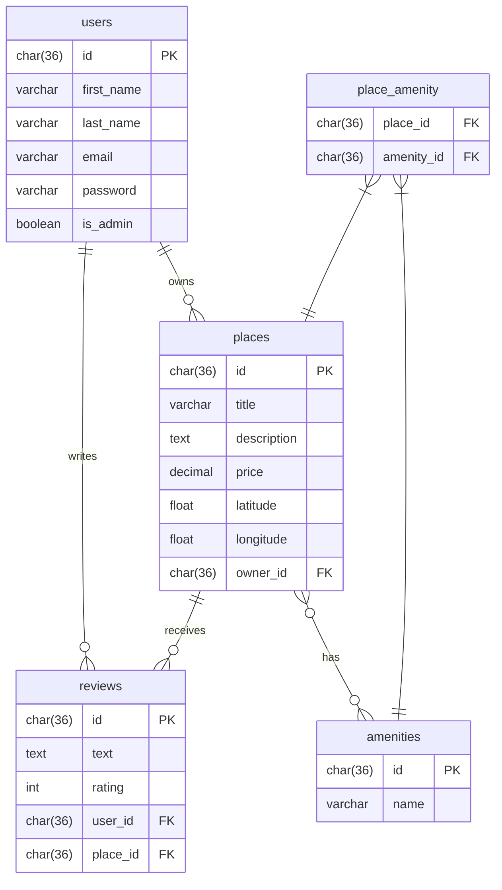

# HBnB Evolution — Part 3: Authentication & Database Persistence

> **Holberton School** — Backend Web Development  
> Flask · SQLAlchemy · JWT · bcrypt · SQLite

---

## Table of Contents

- [Overview](#overview)
- [Project Structure](#project-structure)
- [Technologies](#technologies)
- [Architecture](#architecture)
- [Authentication & Security](#authentication--security)
- [Database](#database)
- [API Endpoints](#api-endpoints)
- [Setup & Installation](#setup--installation)
- [Running the Application](#running-the-application)
- [Testing](#testing)
- [Database Diagram](#database-diagram)

---

## Overview

Part 3 of the HBnB Evolution project extends the Flask REST API built in Part 2 by adding two major features:

1. **JWT Authentication** — Secure login system using JSON Web Tokens
2. **SQLAlchemy Database Persistence** — Replaces the in-memory repository with a real SQLite database

Users can now register, log in, and receive a JWT token to access protected endpoints. Role-Based Access Control (RBAC) ensures that only administrators can perform privileged actions.

---

## Project Structure

```
part2/hbnb/
├── app/
│   ├── __init__.py              # Application Factory (Flask, SQLAlchemy, JWT, bcrypt)
│   ├── api/
│   │   └── v1/
│   │       ├── auth.py          # POST /auth/login — JWT token generation
│   │       ├── users.py         # User endpoints
│   │       ├── places.py        # Place endpoints
│   │       ├── reviews.py       # Review endpoints
│   │       └── amenities.py     # Amenity endpoints
│   ├── models/
│   │   ├── base_model.py        # BaseModel → db.Model (id, created_at, updated_at)
│   │   ├── user.py              # User model + bcrypt password hashing
│   │   ├── place.py             # Place model + many-to-many with Amenity
│   │   ├── review.py            # Review model
│   │   └── amenity.py           # Amenity model
│   ├── persistence/
│   │   └── repository.py        # InMemoryRepository + SQLAlchemyRepository
│   └── services/
│       ├── facade.py            # HBnBFacade — business logic layer
│       └── repositories/
│           └── user_repository.py  # UserRepository (get_user_by_email)
├── instance/
│   └── development.db           # SQLite database (auto-generated)
├── config.py                    # DevelopmentConfig (SQLAlchemy URI, Secret Key)
├── run.py                       # Application entry point
├── create_admin.py              # Script to bootstrap the first admin user
├── schema.sql                   # Raw SQL schema for documentation
├── initial_data.sql             # Initial data (admin + amenities)
├── Database_diagram.md          # ER diagram (Mermaid.js)
└── requirements.txt
```

---

## Technologies

| Technology | Version | Purpose |
|---|---|---|
| Python | 3.x | Core language |
| Flask | Latest | Web framework |
| Flask-RESTX | Latest | REST API + Swagger UI |
| Flask-SQLAlchemy | Latest | ORM — database persistence |
| Flask-JWT-Extended | Latest | JWT authentication |
| Flask-Bcrypt | Latest | Password hashing |
| SQLite | Built-in | Development database |

---

## Architecture

The application follows a **3-layer architecture** with the **Facade pattern**:

```
┌─────────────────────────────────────┐
│         Presentation Layer          │
│   Flask-RESTX API routes (v1/)      │
└──────────────┬──────────────────────┘
               │
               ▼
┌─────────────────────────────────────┐
│         Business Logic Layer        │
│         HBnBFacade                  │
│   (single entry point for all ops)  │
└──────────────┬──────────────────────┘
               │
               ▼
┌─────────────────────────────────────┐
│         Persistence Layer           │
│   SQLAlchemyRepository              │
│   UserRepository                    │
│   SQLite (development.db)           │
└─────────────────────────────────────┘
```

**Why the Facade pattern?**  
The Facade centralizes all business logic. If the database changes (e.g., switching from SQLite to PostgreSQL), only the repository layer needs to be updated — the API routes and Facade remain unchanged.

---

## Authentication & Security

### JWT Flow

```
Client → POST /api/v1/auth/login (email + password)
       ← 200 { "access_token": "eyJ..." }

Client → GET /api/v1/places/ (Authorization: Bearer <token>)
       ← 200 [list of places]
```

### Password Hashing

Passwords are never stored in plain text. bcrypt generates an irreversible hash with a random salt:

```python
# Hashing
self.password = bcrypt.generate_password_hash(password).decode('utf-8')

# Verification
bcrypt.check_password_hash(self.password, raw_password)
```

### Role-Based Access Control (RBAC)

| Role | Permissions |
|---|---|
| **Public** | GET /places/, GET /places/\<id\> |
| **Authenticated User** | Create places & reviews, modify own data |
| **Admin** | All actions, bypass ownership checks |

Admin status is embedded in the JWT token as a claim:

```python
access_token = create_access_token(
    identity=str(user.id),
    additional_claims={"is_admin": user.is_admin}
)
```

Checking admin in a route:

```python
claims = get_jwt()
is_admin = claims.get('is_admin', False)
```

---

## Database

### Models & Relationships

```
users ──────────────────── places
  │  (one-to-many: owns)     │
  │                          │ (one-to-many: receives)
  │ (one-to-many: writes)    │
  └──────── reviews ─────────┘

places ────────────────── amenities
       (many-to-many via place_amenity)
```

### SQLAlchemy Models

All models inherit from `BaseModel` which itself inherits from `db.Model`:

```python
class BaseModel(db.Model):
    __abstract__ = True
    id         = db.Column(db.String(36), primary_key=True, default=lambda: str(uuid.uuid4()))
    created_at = db.Column(db.DateTime, default=datetime.utcnow)
    updated_at = db.Column(db.DateTime, default=datetime.utcnow, onupdate=datetime.utcnow)
```

### Repository Pattern

```python
# Generic repository — works for any model
class SQLAlchemyRepository(Repository):
    def add(self, obj):
        db.session.add(obj)
        db.session.commit()

# Specific repository — adds user-specific queries
class UserRepository(SQLAlchemyRepository):
    def get_user_by_email(self, email):
        return self.model.query.filter_by(email=email).first()
```

---

## API Endpoints

### Public Endpoints (no token required)

| Method | URL | Description |
|---|---|---|
| POST | `/api/v1/auth/login` | Login and get JWT token |
| GET | `/api/v1/places/` | List all places |
| GET | `/api/v1/places/<id>` | Get place details |
| GET | `/api/v1/amenities/` | List all amenities |
| GET | `/api/v1/reviews/` | List all reviews |

### Protected Endpoints (JWT required)

| Method | URL | Rule |
|---|---|---|
| POST | `/api/v1/places/` | Authenticated — owner set automatically |
| PUT | `/api/v1/places/<id>` | Owner only (or admin) |
| POST | `/api/v1/reviews/` | Authenticated — cannot review own place |
| PUT | `/api/v1/reviews/<id>` | Author only (or admin) |
| DELETE | `/api/v1/reviews/<id>` | Author only (or admin) |
| PUT | `/api/v1/users/<id>` | Self only — cannot change email/password |

### Admin-Only Endpoints

| Method | URL | Rule |
|---|---|---|
| POST | `/api/v1/users/` | Admin only |
| POST | `/api/v1/amenities/` | Admin only |
| PUT | `/api/v1/amenities/<id>` | Admin only |
| PUT | `/api/v1/users/<id>` | Admin can modify email + password |

---

## Setup & Installation

### 1. Clone the repository

```bash
git clone https://github.com/<your-username>/holbertonschool-hbnb.git
cd holbertonschool-hbnb/part2/hbnb
```

### 2. Install dependencies

```bash
pip install -r requirements.txt
```

### 3. Initialize the database

```bash
export FLASK_APP=run.py
flask shell
>>> from app import db
>>> db.create_all()
>>> exit()
```

### 4. Create the first admin user

```bash
python create_admin.py
```

This script creates an admin user (`admin@hbnb.com` / `Admin-1234`) and starts the server.

---

## Running the Application

```bash
python create_admin.py
```

The API is available at: `http://127.0.0.1:5000`  
Swagger UI: `http://127.0.0.1:5000/api/v1/`

### Authenticating in Swagger

1. `POST /api/v1/auth/login` → copy the `access_token`
2. Click **Authorize** 🔒 at the top of Swagger
3. Enter: `Bearer <your_token>`
4. Click **Authorize** → **Close**

---

## Testing

### Create a place (authenticated)

```bash
curl -X POST "http://127.0.0.1:5000/api/v1/places/" \
  -H "Authorization: Bearer <token>" \
  -H "Content-Type: application/json" \
  -d '{"title": "Villa", "price": 100, "latitude": 48.8, "longitude": 2.3, "owner_id": "", "amenities": []}'
```

### Test unauthorized access

```bash
curl -X PUT "http://127.0.0.1:5000/api/v1/places/<place_id>" \
  -H "Authorization: Bearer <other_user_token>" \
  -d '{"title": "Hacked"}'
# Expected: 403 {"error": "Unauthorized action"}
```

### Test public endpoint (no token)

```bash
curl -X GET "http://127.0.0.1:5000/api/v1/places/"
# Expected: 200 [list of places]
```

---

## Database Diagram



---
Saby Jeany**

 — Holberton School  
AirBnB clone HBnB Evolution Project — Part 3